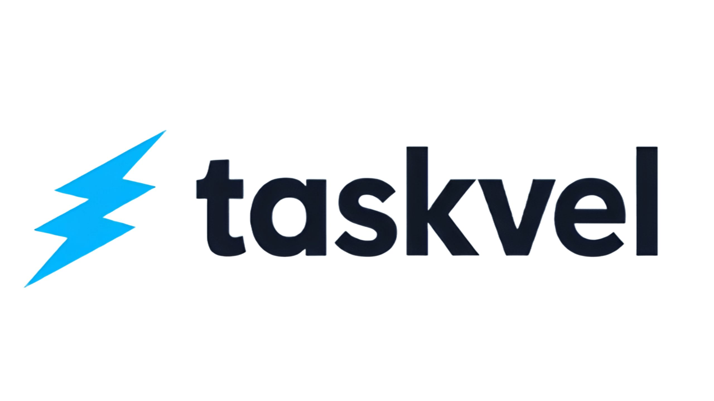

<p align="center">
  
</p>

<p align="center">
  
  
  
  
  
</p>

<p align="center">
  <b>PHP</b> 8.2+ &nbsp;•&nbsp;
  <b>Laravel</b> 12.x &nbsp;•&nbsp;
  <b>React</b> 19.x &nbsp;•&nbsp;
  <b>Vite</b> 5.x &nbsp;•&nbsp;
  <b>TypeScript</b> 5.x
</p>

> Gerenciador de tarefas desenvolvido como estudo prático, utilizando Laravel no backend e React no frontend. O projeto serve como referência para integração moderna entre um backend robusto e um frontend reativo, com foco em boas práticas.

---

## Índice

- [Sobre](#-sobre)
- [Funcionalidades](#-funcionalidades)
- [Tecnologias Utilizadas](#-tecnologias-utilizadas)
- [Estrutura do Projeto](#-estrutura-do-projeto)
- [Modelagem de Dados](#-modelagem-de-dados)
- [Começando](#-começando)
- [Estrutura dos Componentes](#-estrutura-dos-componentes)

---

## Sobre

**Taskvel** é uma aplicação web para gerenciamento de tarefas. O projeto foi criado como um estudo prático para aprimorar habilidades na integração de um backend **Laravel** com um frontend moderno em **React**, seguindo as melhores práticas de desenvolvimento e documentação.

## Funcionalidades

- **Listas de tarefas:** Criação, edição, exclusão e visualização.
- **Tarefas:** Adição, atualização, marcação de conclusão e remoção dentro das listas.
- **Relacionamentos:** Vínculo claro entre usuários, listas e tarefas.
- **Interface Moderna:** Frontend em React consumindo a API RESTful do Laravel.

## Tecnologias Utilizadas

- **Backend:** Laravel 11, PHP 8.2+, Eloquent ORM, Migrations.
- **Frontend:** React 19, Vite, TypeScript, TailwindCSS, shadcn/ui, Radix UI.
- **Banco de Dados:** MySQL.
- **Ferramentas:** Composer, NPM/Yarn, Git.

## Estrutura do Projeto

```
/taskvel
├── app/                  # Código Laravel (Controllers, Models, Requests)
├── database/             # Migrations e seeds
├── public/               # Entrypoint e assets
├── resources/            # Views e código React
├── routes/               # Rotas web e API
├── Projeto Taskvel/      # Documentação detalhada e canvas
├── .env.example          # Exemplo de configuração
├── composer.json         # Dependências PHP
├── package.json          # Dependências Node/React
└── ...
```

## Modelagem de Dados

### Listas (`lists`)

| Coluna      | Tipo     | Descrição                             |
|-------------|----------|---------------------------------------|
| `id`        | bigint   | Chave primária                        |
| `title`     | string   | Título obrigatório da lista           |
| `description`| string   | Descrição opcional                    |
| `user_id`   | bigint   | Chave estrangeira para `users(id)`    |

### Tarefas (`tasks`)

| Coluna         | Tipo     | Descrição                               |
|----------------|----------|-----------------------------------------|
| `id`           | bigint   | Chave primária                          |
| `title`        | string   | Título obrigatório da tarefa            |
| `description`  | string   | Descrição opcional                      |
| `is_completed` | boolean  | Status da tarefa (padrão: `false`)      |
| `due_date`     | date     | Data de vencimento opcional             |
| `list_id`      | bigint   | Chave estrangeira para `lists(id)`      |

## Começando

Siga os passos abaixo para configurar e executar o projeto em seu ambiente local.

### Pré-requisitos

- PHP 8.2+
- Composer
- Node.js & NPM/Yarn
- Servidor de Banco de Dados (ex: MySQL)

### Instalação

1. **Clone o repositório:**
   ```sh
   git clone https://github.com/seu-usuario/taskvel.git
   cd taskvel
   ```

2. **Configure o Backend (Laravel):**
   ```sh
   cp .env.example .env       # Crie o arquivo de ambiente
   composer install           # Instale as dependências PHP
   php artisan key:generate   # Gere a chave da aplicação
   ```
   *Não se esqueça de configurar a conexão com o banco de dados no arquivo `.env`.* 

3. **Execute as Migrations:**
   ```sh
   php artisan migrate
   ```

4. **Configure o Frontend (React):**
   ```sh
   npm install
   # ou
   yarn install
   ```

5. **Execute a Aplicação:**
   - **Terminal 1 (Backend):**
     ```sh
     php artisan serve
     ```
   - **Terminal 2 (Frontend):**
     ```sh
     npm run dev
     ```

6. **Acesse:**
   - Backend (API): [http://localhost:8000](http://localhost:8000)
   - Frontend: [http://localhost:5173](http://localhost:5173) (ou a porta indicada pelo Vite)

## Estrutura dos Componentes

- **Controllers:**
  - `TaskController`: Gerencia o CRUD de tarefas.
  - `ListController`: Gerencia o CRUD de listas.
  - `DashboardController`: Controla o painel principal.
- **Requests:**
  - `StoreTaskRequest`, `UpdateTaskRequest`: Validações para criar/atualizar tarefas.
  - `StoreListRequest`, `UpdateListRequest`: Validações para criar/atualizar listas.